```mermaid
flowchart LR
    A["Raw MLS tiles<br/>PLY / LAS / LAZ"] --> B["Bronze<br/>source files + manifests"]
    B --> C["Dataset registry<br/>metadata + Parquet analytics"]
    C --> D["Dash control plane<br/>upload · profile · trigger · monitor"]
    D --> E["Airflow preprocessing DAG<br/>remote GPU worker"]
    E --> F["Silver<br/>cleaned cloud + HAG + normals + density"]
    F --> G["Gold<br/>.npz blocks — 16384 x 9"]
    G --> H["Training<br/>PointNet++ SSG / MSG / RandLA-Net"]
    H --> I["MLflow + DVC<br/>experiments + versioned artifacts"]
    I --> J["DBSCAN + RANSAC<br/>building instances"]
    J --> K["Storey estimation<br/>height · confidence · QA flags"]
    K --> L["GIS exports + BigQuery<br/>Looker Studio inventory dashboard"]
```

# LiDAR MLOps Platform

> End-to-end geospatial data engineering and MLOps platform that turns raw Mobile LiDAR scans into a governed building inventory — medallion data lake, Airflow orchestration, MLflow tracking, DVC versioning, 3D deep-learning segmentation (**0.9794 test mIoU**), and BigQuery/Looker Studio delivery.

[](https://github.com/sanskar-sri/Lidar-MLOps-Platform/actions/workflows/ci.yml)


**[Demo](#see-it-working)** · **[Overview](#overview)** · **[Architecture](#architecture)** · **[Pipeline](#pipeline-stages)** · **[Results](#results)** · **[Data lake](#data-lake-layout)** · **[Stack](#technical-stack)** · **[Setup](#local-setup)** · **[FAQ](#faq)**

---

## See It Working

| | |
|---|---|
| ▶️ **Video walkthrough** | [Watch on YouTube](https://www.youtube.com/watch?v=Ok_hFJ7_PNY) — platform tour, from raw point cloud to building inventory |
| 📊 **Live dashboard** | [MLS Building Inventory Dashboard](https://lookerstudio.google.com/s/lx-XS32m5do) — BigQuery-backed Looker Studio report, the actual output of this pipeline |
| 📐 **3D viewer** | Rerun SDK recordings of semantically labelled point clouds — see [screenshots](#platform-screenshots) |

[](https://www.youtube.com/watch?v=Ok_hFJ7_PNY)

---

## At a Glance

| | |
|---|---|
| **Problem** | Convert raw street-level Mobile LiDAR into a structured, auditable building inventory |
| **Dataset** | Paris-Lille-3D MLS benchmark — Velodyne HDL-32E on the L3D2 mobile mapping platform |
| **Scale** | **111.7M model-ready point entries** across 6,818 Gold blocks (16,384 points × 9 features each) |
| **Best model** | **PointNet++ SSG — test mIoU 0.9794 · building IoU 0.9695 · overall accuracy 0.9920** |
| **Benchmarked** | PointNet++ SSG vs. PointNet++ MSG vs. RandLA-Net under one identical input contract and eval protocol |
| **Held-out test** | 8.5M unique points, reconstructed from overlapping blocks via `orig_idx` — no train/val leakage |
| **Downstream** | DBSCAN instancing → RANSAC façade refinement → footprints → height → storey counts → QA flags |
| **Data platform** | Six-zone medallion lake on S3-compatible object storage, Airflow-orchestrated, DVC-versioned |
| **Control plane** | 15-page Dash application — upload, profile, trigger, monitor, validate, export |
| **Serving layer** | GeoJSON / GeoPackage / GeoParquet → BigQuery → Looker Studio review dashboard |

---

## Overview

Raw Mobile LiDAR is large, unstructured, and dataset-specific — it is not directly usable for machine learning, and a trained model alone is not a product. This repository closes both gaps: it is a **data platform first and a model repository second**.

It ingests `.ply` / `.las` / `.laz` survey tiles into a governed Bronze/Silver/Gold lake, orchestrates preprocessing with Airflow on a remote GPU worker, trains and compares three point-cloud segmentation architectures with MLflow tracking and DVC versioning, then promotes point-wise predictions into **object-level building instances with footprints, heights, estimated storey counts, confidence values, and QA flags** — published to BigQuery and reviewed in Looker Studio.

The engineering contribution is **integration and reproducibility**, not a new neural network: every stage is versioned, every artifact is addressable by `dataset_id / prep_version / model / run_id`, and every run is traceable from raw tile to final inventory row.

**Target use cases:** urban digital twins · smart-city mapping · building inventory generation · cadastral pre-screening · flood and disaster risk exposure · infrastructure asset monitoring · catastrophe modelling input data

---

## Architecture




<!--
  TODO — 15-20s screen-recording GIF of the dashboard: dataset upload → readiness check →
  Airflow trigger → Silver/Gold validation → inventory output. Record with Kap or LICEcap,
  keep it under 10MB, commit to assets/demo.gif, then uncomment:

  ### Platform preview
  
-->

---

## Pipeline Stages

### 1 · Ingestion and profiling (Bronze)
Raw tiles and label maps are uploaded with checksummed manifests. The registry generates dataset metadata, spatial summaries, class mappings, label-availability checks, and Parquet analytics — all inspectable in the Data Explorer before a single GPU cycle is spent.

### 2 · Preprocessing (Silver → Gold)
Airflow runs coordinate offset normalisation, semantic label remapping, uniform cubic voxelisation, Height-Above-Ground computation, surface-normal estimation, and local density computation, then emits fixed-size model-ready blocks.

| Parameter | Value | Purpose |
|---|---|---|
| Voxel size | 0.02 m | Uniform cubic voxelisation |
| HAG grid | 0.5 m × 0.5 m | Local ground estimation |
| HAG statistic | 5th percentile Z | Robust ground elevation |
| Normal radius | 0.5 m | Local surface normal estimation |
| Density radius | 0.5 m | Local point density |
| Feature channels | 9 | `x, y, z, HAG, intensity, nx, ny, nz, density` |
| Points per block | 16,384 | Fixed model input size |

Label remapping collapses the original multi-class scene into a binary target, with an explicit ignore class excluded from both loss and metrics:

| Original class | Pipeline label | Meaning |
|---|---|---|
| `c = 2` | `1` | Building |
| `c ∈ {1,3,4,5,6,7,8,9}` | `0` | Non-building |
| `c = 0` | `-1` | Ignore (excluded from loss and evaluation) |

**Gold block schema** — every block carries what training, reconstruction, and export all need:

| Key | Shape | Purpose |
|---|---|---|
| `feat` | `[16384, 9]` | Model input features |
| `feat_channels` | variable | Channel names and order (contract validation) |
| `y` | `[16384]` | Point-wise labels |
| `xyz_global` | `[16384, 3]` | Global coordinates for reconstruction and export |
| `orig_idx` | `[16384]` | Original point index for prediction reassembly |
| `valid_mask` | `[16384]` | Valid vs. padded point tracking |
| `metadata` | varies | Block ID, split, bounds, dataset info |

**Spatial split** — blocks are split spatially, not randomly, to prevent neighbourhood leakage between train and test:

| Split | Blocks | Points/block | Point entries |
|---|---|---|---|
| Train | 2,999 | 16,384 | ~49.1 M |
| Validation | 1,697 | 16,384 | ~27.8 M |
| Test | 2,122 | 16,384 | ~34.8 M |

### 3 · Training
All three architectures train against the same input contract (`[B, 16384, 9] → [B, 16384, 2]`), the same loss, and the same evaluation protocol — so the comparison is genuinely apples-to-apples.

| Setting | Value |
|---|---|
| Loss | Weighted Focal Loss (γ = 2.0) |
| Class weights | `[0.813, 1.187]` — inverse-square-root, normalised to mean 1 |
| Optimizer | Adam, LR 0.001 |
| Scheduler | Cosine annealing |
| Augmentation | Z-rotation 0–2π · XYZ scale 0.8–1.2 · Gaussian jitter 0.01 · random X flip (train only) |
| Precision | Mixed precision, gradient clipping at max-norm 1.0 |
| Checkpointing | Best checkpoint selected on **validation** mIoU; test set touched once, at the end |

### 4 · Point → object conversion
Segmentation gives labels, not buildings. DBSCAN (`eps = 1.5 m`, `min_points = 500`, `min_cluster_points = 2000`) groups predicted building points into candidate instances; RANSAC façade refinement then detects near-vertical planes and splits merged clusters using density-gap and façade orientation/offset cuts. Unsplittable cases are **retained and flagged** rather than silently forced apart — auditability over false precision.

### 5 · Attribution and delivery
Robust building height is taken as the 95th percentile of valid HAG values, and storey count estimated as `round(H / 3.2 m)`. Outputs are exported as GeoJSON / GeoPackage / GeoParquet, loaded to BigQuery, and surfaced in a Looker Studio review dashboard.

---

## Results

### Segmentation benchmark

| Model | Test mIoU | Building IoU | Non-building IoU | Overall accuracy | Best checkpoint |
|---|---|---|---|---|---|
| **PointNet++ SSG** | **0.9794** | **0.9695** | **0.9893** | **0.9920** | Epoch 66 |
| PointNet++ MSG | 0.9775 | 0.9667 | 0.9883 | 0.9913 | Epoch 64 |
| RandLA-Net | 0.9156 | 0.8785 | 0.9528 | 0.9648 | Epoch 30 |

### Test-set confusion matrix

| Model | TN | FP | FN | TP |
|---|---|---|---|---|
| PointNet++ SSG | 6,282,503 | 48,495 | 19,374 | 2,155,027 |
| PointNet++ MSG | 6,279,339 | 51,659 | 22,411 | 2,151,990 |
| RandLA-Net | 6,042,215 | 288,783 | 10,590 | 2,163,811 |

### Derived class-wise rates

| Model | Non-building correct rate | Building recall | Building precision |
|---|---|---|---|
| PointNet++ SSG | 0.9923 | 0.9911 | **0.9780** |
| PointNet++ MSG | 0.9918 | 0.9897 | 0.9765 |
| RandLA-Net | 0.9544 | **0.9951** | 0.8824 |

> **Why the simpler model won.** PointNet++ MSG is architecturally richer, but multi-scale grouping bought nothing here: the task is binary, and preprocessing already supplies strong geometric priors (HAG, surface normals, local density, intensity) on voxelised blocks. Single-scale grouping was sufficient to separate façades from vegetation, poles, and street furniture.
>
> **Why highest recall ≠ best model.** RandLA-Net achieves the best building recall (0.9951) but the worst precision (0.8824) — it over-predicts the building class, generating ~5.9× more false positives than SSG. That noise propagates: it produced 2.46M building points, 25 raw DBSCAN clusters, and 16 fragmented final instances, versus 10 stable instances from SSG. **Upstream precision, not recall, is what controls downstream instance quality.**

### Building instance extraction

| Model | Building points | Raw clusters | Valid initial instances | Final instances (post-RANSAC) | Splits | Silhouette |
|---|---|---|---|---|---|---|
| **PointNet++ SSG** | 2,209,005 | 18 | 8 | **10** | 2 | **0.4907** |
| PointNet++ MSG | 2,209,097 | 20 | 8 | 11 | 2 | 0.4552 |
| RandLA-Net | 2,462,131 | 25 | 9 | 16 | 4 | 0.3802 |

DBSCAN, RANSAC, and QA parameters were held constant across all three model outputs — so the differences in final instance counts are attributable to upstream segmentation behaviour, not post-processing tuning. Silhouette is computed on XY coordinates without ground truth, so it is an **internal diagnostic, not an instance-segmentation accuracy metric**.

### Building inventory output

The final layer is a per-building row, not a point cloud: `building_id`, footprint geometry, robust height, estimated storeys, floor-height assumption, method, confidence, QA flags, and layer status.

From the PointNet++ SSG run: **10 final building instances, average 2.1 estimated storeys**, measured heights ranging 4.97 m – 8.94 m, with **2 instances routed to a priority-review shortlist** by confidence and QA flags. Instances carrying `oversized_likely_merged` are downgraded to LOW confidence rather than published as clean records.

▶️ **[Explore the live dashboard](https://lookerstudio.google.com/s/lx-XS32m5do)** — per-building storey count, measured height, map location, confidence banding, and the official-review shortlist.

<!--
  TODO: add a still image of the Looker Studio dashboard as a fallback for readers who
  don't click through. Drag the PNG into any GitHub issue comment to get a permanent
  user-attachments URL, then uncomment and paste it below.

  
-->

> **Scope, stated honestly.** Storey counts are a geometry-only baseline with layer status `GEOMETRY_ONLY_PRE_VALIDATION`. They are not validated against cadastral or BD TOPO / BDNB reference data, and are designed as a *review shortlist for official verification* — which is exactly what the dashboard delivers.

---

## Platform Screenshots

**Dashboard — home page with live infrastructure status**


**Data Explorer — dataset analytics workspace with point counts, label availability, and spatial summary**


**Rerun 3D viewer — semantically labelled MLS point cloud (street scene)**


---

## Data Lake Layout

Six-zone layout on Backblaze B2 (S3-compatible) — medallion architecture extended across the full ML lifecycle:

```text
Building-Identification-MLS/
│
├── 01_raw_data/
│   └── bronze_raw_data/
│       └── <dataset_id>/
│           ├── source_files/
│           │   ├── tiles/              # raw .ply / .las / .laz point-cloud tiles
│           │   └── label_maps/         # per-tile annotation files
│           └── manifests/              # upload manifests with checksums and file lists
│
├── 02_preprocessing/
│   ├── silver_preprocessed_data/
│   │   └── <dataset_id>/<prep_version>/    # cleaned cloud + stats + density grids
│   └── gold_model_ready_data/
│       └── <dataset_id>/<prep_version>/    # model-ready .npz blocks (16384 x 9)
│
├── 03_segmentation/
│   ├── training_runs/
│   │   └── <dataset_id>/<prep_version>/<model_name>/<run_id>/   # checkpoints + configs
│   └── segmentation_outputs/
│       └── <dataset_id>/<prep_version>/<model_name>/<run_id>/   # per-tile predictions
│
├── 04_clustering/
│   └── clustered_final_outputs/
│       └── <dataset_id>/<prep_version>/<model_name>/<run_id>/   # DBSCAN + RANSAC results
│
├── 05_applications/
│   ├── gis_exports/                    # GeoJSON / GeoPackage / GeoParquet
│   └── risk_exposure/                  # flood / height / confidence scoring outputs
│
└── 06_governance/
    ├── metadata/datasets/              # dataset registry JSON
    ├── metadata_analytics/<dataset_id>/# Parquet: file summary, label distribution,
    │                                   #   spatial summary, quality checks, density grids, KPIs
    ├── benchmark_results/              # committed accuracy and IoU reports
    ├── lineage/                        # dataset-to-run lineage records
    ├── qc_reports/                     # automated quality check outputs
    ├── logs/                           # preprocessing and training run logs
    └── rerun_outputs/                  # Rerun SDK 3D visualisation recordings
```

Everything is addressable by `dataset_id / prep_version / model_name / run_id`, so any inventory row can be traced back to the exact checkpoint, preprocessing version, and source tile that produced it.

---

## Output Artifacts

| Stage | Artifacts |
|---|---|
| Preprocessing | `processed_cloud.npz`, Gold `.npz` blocks, preprocessing metadata, readiness/QC reports |
| Training | `best_model_checkpoint`, training logs, `test_metrics.json`, `test_predictions.las`, `test_errors.las` |
| Clustering | `building_instances_initial/refined/final.las`, `building_instances_final_summary.csv`, `building_footprints_final.geojson` / `.gpkg`, `final_instance_qa_report.json`, `final_instances_manifest.json` |
| Storey estimation | `building_storey_count_final.csv` |
| Delivery | GIS exports, BigQuery tables, Looker Studio dashboard, lineage and governance reports |

`test_errors.las` — a dedicated misclassified-point cloud for visual error analysis — is deliberately part of the contract, not an afterthought.

---

## Dashboard Pages

| Page | Route | Purpose |
|---|---|---|
| Home | `/` | Platform overview and live infrastructure health |
| Data Explorer | `/data-explorer` | Upload raw LiDAR, browse datasets, inspect Parquet analytics |
| Dataset Readiness | `/dataset-readiness` | Preprocessing gate — metadata, labels, coordinate sanity, block feasibility |
| Preprocessing | `/preprocessing` | Configure, trigger, and monitor Airflow preprocessing runs |
| Silver / Gold Outputs | `/silver-gold-outputs` | Validate preprocessing artifacts and the Gold data contract |
| Training | `/training` | Model/compute selection, payload preview, run history, GPU worker checks |
| Inference Outputs | `/inference-outputs` | Segmentation metrics, confusion matrices, prediction files |
| Postprocessing | `/postprocessing` | Clustering, RANSAC refinement, QA, final instance publishing |
| GIS Exports | `/gis-exports` | Generate and download GeoJSON / GeoPackage / GeoParquet |
| Risk Exposure | `/risk-exposure` | Flood depth, building height, and detection confidence scoring |
| Model Benchmark | `/model-benchmark` | Accuracy, IoU, and latency comparison across runs |
| Lineage & Governance | `/lineage-governance` | Dataset lineage, quality checks, audit records |
| Monitoring & Cost | `/monitoring-cost` | Storage growth, processing cost, pipeline health KPIs |
| Control Panel | `/control-panel` | Compute node status, service health, runtime checks |
| API Integration | `/api-integration` | External system connections and integration status |

---

## Airflow DAGs

| DAG | Trigger | Purpose |
|---|---|---|
| `lidar_preprocessing_pipeline` | Manual | Full Bronze → Silver → Gold run on the remote GPU workstation |
| `lidar_training_pipeline` | Manual | Model training against Gold model-ready blocks |
| `dag_health_b2` | Scheduled | B2 reachability and bucket prefix health check |
| `dag_health_remote` | Scheduled | MLflow, GPU, OS, and runtime health on the workstation |

---

## Technical Stack

| Area | Technologies |
|---|---|
| Application & UI | Python, Dash, Dash Bootstrap Components, Plotly |
| Point-cloud I/O | Open3D, plyfile, laspy, lazrs |
| Geospatial | GeoPandas, Shapely, pyproj, GeoParquet |
| Analytics | Pandas, PyArrow, Parquet |
| Object storage | Backblaze B2 — S3-compatible via b2sdk + boto3 |
| Orchestration | Apache Airflow |
| Experiment tracking | MLflow |
| Dataset versioning | DVC |
| 3D visualisation | Rerun SDK |
| Deep learning | PyTorch, PointNet++ (SSG/MSG), RandLA-Net |
| Post-processing | DBSCAN, RANSAC, scikit-learn |
| Warehouse & BI | BigQuery, Looker Studio |
| CI | GitHub Actions, ruff |
| Deployment | Docker, Docker Compose |
| Training hardware | NVIDIA RTX PRO 5000 Blackwell workstation (Windows 11 GPU worker) |

---

## Repository Structure

```text
.
├── app.py                               # Dash app entrypoint
├── pages/                               # Dashboard page modules (one per route)
├── components/                          # Reusable UI cards and layout sections
├── services/                            # B2, metadata, Airflow, MLflow, training,
│                                        #   risk, GIS, lineage, benchmark services
├── airflow_dags/
│   └── dags/
│       ├── dag_health_b2.py
│       └── dag_health_remote.py
├── scripts/
│   └── compute_node_health_agent.py     # Windows workstation health agent
├── .github/workflows/ci.yml             # Lint and import checks on push
├── assets/                              # CSS and browser-upload JavaScript
├── data/
│   ├── metadata/                        # Local dataset registry cache
│   └── metadata_analytics/              # Local Parquet analytics cache
├── Dockerfile
├── docker-compose.yml
└── requirements.txt
```

---

## Local Setup

```bash
# 1. Clone and create environment
git clone https://github.com/sanskar-sri/Lidar-MLOps-Platform.git
cd Lidar-MLOps-Platform
python3 -m venv .venv
source .venv/bin/activate        # Windows: .venv\Scripts\activate
pip install -r requirements.txt

# 2. Configure environment
cp .env.example .env
# Fill in B2, Airflow, and MLflow credentials (see below)

# 3. Run with Docker
docker compose up --build
```

| Service | URL |
|---|---|
| Dash app | `http://localhost:8051` |
| MLflow | `http://localhost:5001` |

### Environment variables

```env
B2_KEY_ID=
B2_APPLICATION_KEY=
B2_BUCKET_NAME=

AIRFLOW_API_BASE_URL=
AIRFLOW_USERNAME=
AIRFLOW_PASSWORD=

MLFLOW_TRACKING_URI=
MLFLOW_PUBLIC_URL=

SYSTEM_1_HEALTH_URL=
SYSTEM_1_AIRFLOW_QUEUE=
```

No credentials are committed to this repository — all secrets are supplied via environment variables at runtime. Private machine names, workstation IPs, and local filesystem paths stay in `.env` and private runbooks.

---

## Key Design Decisions

**No heavy compute in the controller.**
The Dash app triggers Airflow and reads artifacts; all preprocessing and training runs on a remote GPU workstation. The controller never imports point-cloud or deep-learning libraries in the request path.

**Minimal Airflow conf.**
The controller sends only `{dataset_id, mode, run_id}`. Pipeline defaults, paths, and hyperparameters live on the worker side. Full audit payloads are persisted locally before the DAG is triggered — giving both a reproducible run record and clean separation between orchestration and configuration.

**Lazy service imports.**
Heavy dependencies (b2sdk, pandas, numpy, plyfile, laspy, pyarrow, open3d) are imported inside function bodies, not at module level. Dash startup stays under 3 seconds regardless of what is installed, and the UI loads before any cloud or model library initialises.

**Object storage as the single source of truth.**
Silver and Gold artifacts are always read from B2 after DAG completion, never from local disk. Dashboard, training environment, and analytics layer all share one data layer — eliminating drift between local cache and remote outputs.

**S3-portable lake design.**
Bucket layout and service code use S3-compatible semantics via boto3. Moving from Backblaze B2 to AWS S3 or GCS is an environment-variable change, not a code change.

**Readiness gates before expensive jobs.**
The Dataset Readiness page validates metadata completeness, label availability, coordinate sanity, and block feasibility *before* preprocessing is triggered — failing fast instead of burning GPU hours on a malformed dataset. The Gold data contract is validated the same way before training begins.

**Explicit ignore label.**
Unlabelled points are retained in the data as `-1` and excluded from both loss computation and metric evaluation, rather than silently folded into the negative class — which would inflate reported accuracy.

---

## Engineering Notes — Bugs Found and Fixed

| Bug | Root cause | Fix |
|---|---|---|
| Preprocessing page returned HTTP 500 during early callback initialisation | Preview callbacks fired before all tab inputs were initialised | Added callback guards and delayed preview initialisation |
| Verify section used stale UI state if fields were edited after trigger | DAG run store did not carry output prefix/version details | Persist run-specific `b2_silver_prefix` and `prep_version` at trigger time |
| Airflow trigger sent an overly broad controller payload | Remote workstation owns pipeline defaults | Send minimal conf to Airflow, persist the full audit payload locally |
| Silver readers missed the current DAG output layout | DAG writes key Silver analytics into an `analytics/` subfolder | Silver loaders try `analytics/` first, retain flat-path fallback |

---

## FAQ

**Why Airflow rather than cron?**
The pipeline needs retries with backoff, task-level failure isolation, run history, and a queryable state API the Dash controller polls for DAG and task status. Cron gives none of that — a failed preprocessing run at 2 a.m. would be silent, and I'd have no record of which run produced which Silver artifact.

**Why Bronze/Silver/Gold rather than one processed folder?**
The layers have different contracts and different reprocessing costs. Bronze is immutable source-of-truth with checksums. Silver is cleaned and feature-enriched but still model-agnostic. Gold is model-specific — fixed 16,384-point blocks with a validated schema. Changing a training hyperparameter shouldn't force re-voxelisation of the whole cloud, and separating the layers means it doesn't.

**Why Backblaze B2 rather than S3?**
Cost, for a self-funded thesis. B2 is S3-compatible and every access goes through boto3, so the migration path is an environment variable, not a rewrite. The bucket layout and service code make no B2-specific assumptions.

**Why Dash rather than Streamlit?**
Streamlit re-runs the whole script on interaction, which is fine for a single-view demo and wrong for a 15-page operational console with independent polling callbacks, run-state stores, and multi-tab artifact browsers. Dash's callback graph and URL routing were the requirement.

**Why binary segmentation rather than full multi-class?**
The deliverable is a building inventory, so only the building class carries downstream value. Binary framing also let me spend the compute budget on comparing three architectures under an identical protocol rather than chasing multi-class leaderboard numbers. The trade-off is stated in Known Limitations — these results say nothing about separating poles from vegetation.

**Why is the winning model the simplest one?**
See the Results discussion — preprocessing already supplies HAG, surface normals, and local density, so multi-scale grouping had little left to contribute on a binary task. The more interesting finding is that the *highest-recall* model was the worst choice, because its false positives fragmented downstream building instances.

---

## Known Limitations

Stated deliberately — these are the boundaries of what the numbers above actually claim.

- **Binary task.** The model is evaluated on building vs. non-building only; it is not tested on distinguishing vegetation, poles, vehicles, or street furniture from each other.
- **High segmentation accuracy ≠ perfect instances.** False positives can bridge neighbouring buildings; false negatives can fragment true façades. Instance quality is controlled by upstream precision.
- **DBSCAN parameters are scene-tuned.** `eps = 1.5 m` suits this MLS street geometry; different point densities, street widths, or façade spacings will need re-tuning.
- **RANSAC cannot separate every merged case.** Shared walls, similar façade orientations, or insufficient vertical plane evidence leave clusters unsplit — these are flagged for review rather than forced.
- **Silhouette is a diagnostic, not an accuracy metric.** It uses no ground truth and cannot confirm that a final instance maps to exactly one real building.
- **Storey counts are geometry-only.** A fixed 3.2 m floor-height assumption on a 95th-percentile HAG height, unvalidated against cadastral reference data.

---

## Roadmap

- [ ] Point Transformer v3 (Pointcept) as a fourth benchmarked architecture
- [ ] Validate storey estimates against BD TOPO / BDNB cadastral reference data
- [ ] Adaptive DBSCAN parameter selection from local point density statistics
- [ ] Roof type classification — flat vs. sloped from Z-variance in the top point layer
- [ ] Fire spread risk scoring from inter-building distance
- [ ] GIS export support for CityJSON and 3D Tiles
- [ ] External hazard overlays — OSM Overpass API, TRCA and PPRI Nord flood zones
- [ ] Earthquake exposure module — height category joined against USGS / BRGM seismic zones
- [ ] CI expansion — service import checks, page registration validation, metadata schema tests
- [ ] Cloud reference architecture with cost-aware AWS / GCP deployment guide

---

## Research & Acknowledgements

Developed as an M.Tech thesis at **MNNIT Allahabad, Prayagraj** — Geographic Information System (GIS) Cell — under the supervision of **Dr. Manohar Yadav**.

*Building Identification in Mobile LiDAR Data Using Deep Learning* (2026).

Also presented at **SPARC 2026 International Conference, IIT Kanpur** — *Self-Supervised Learning for Near-Miss Pedestrian Risk Detection* — an internationally collaborative research programme supported by the Ministry of Education, Government of India.

Dataset: Paris-Lille-3D (Roynard et al.), acquired with the L3D2 mobile mapping prototype, Mines ParisTech.

---

## Citation

```bibtex
@mastersthesis{srivastava2026lidar,
  author  = {Srivastava, Sanskar},
  title   = {Building Identification in Mobile LiDAR Data Using Deep Learning},
  school  = {Motilal Nehru National Institute of Technology Allahabad},
  address = {Prayagraj, India},
  year    = {2026},
  type    = {M.Tech. thesis},
  note    = {Department of Geoinformatics, GIS Cell}
}
```

---

## Contact

**Sanskar Srivastava** — Data Engineer · Geospatial ML

[GitHub](https://github.com/sanskar-sri) · [LinkedIn](https://linkedin.com/in/sanskar-srivastava-360666170) · sanskaranmol786@gmail.com

---

## License

MIT
---

## Architecture


---

## Pipeline Stages

### 1 · Ingestion and profiling (Bronze)
Raw tiles and label maps are uploaded with checksummed manifests. The registry generates dataset metadata, spatial summaries, class mappings, label-availability checks, and Parquet analytics — all inspectable in the Data Explorer before a single GPU cycle is spent.

### 2 · Preprocessing (Silver → Gold)
Airflow runs coordinate offset normalisation, semantic label remapping, uniform cubic voxelisation, Height-Above-Ground computation, surface-normal estimation, and local density computation, then emits fixed-size model-ready blocks.

| Parameter | Value | Purpose |
|---|---|---|
| Voxel size | 0.02 m | Uniform cubic voxelisation |
| HAG grid | 0.5 m × 0.5 m | Local ground estimation |
| HAG statistic | 5th percentile Z | Robust ground elevation |
| Normal radius | 0.5 m | Local surface normal estimation |
| Density radius | 0.5 m | Local point density |
| Feature channels | 9 | `x, y, z, HAG, intensity, nx, ny, nz, density` |
| Points per block | 16,384 | Fixed model input size |

Label remapping collapses the original multi-class scene into a binary target, with an explicit ignore class excluded from both loss and metrics:

| Original class | Pipeline label | Meaning |
|---|---|---|
| `c = 2` | `1` | Building |
| `c ∈ {1,3,4,5,6,7,8,9}` | `0` | Non-building |
| `c = 0` | `-1` | Ignore (excluded from loss and evaluation) |

**Gold block schema** — every block carries what training, reconstruction, and export all need:

| Key | Shape | Purpose |
|---|---|---|
| `feat` | `[16384, 9]` | Model input features |
| `feat_channels` | variable | Channel names and order (contract validation) |
| `y` | `[16384]` | Point-wise labels |
| `xyz_global` | `[16384, 3]` | Global coordinates for reconstruction and export |
| `orig_idx` | `[16384]` | Original point index for prediction reassembly |
| `valid_mask` | `[16384]` | Valid vs. padded point tracking |
| `metadata` | varies | Block ID, split, bounds, dataset info |

**Spatial split** — blocks are split spatially, not randomly, to prevent neighbourhood leakage between train and test:

| Split | Blocks | Points/block | Point entries |
|---|---|---|---|
| Train | 2,999 | 16,384 | ~49.1 M |
| Validation | 1,697 | 16,384 | ~27.8 M |
| Test | 2,122 | 16,384 | ~34.8 M |

### 3 · Training
All three architectures train against the same input contract (`[B, 16384, 9] → [B, 16384, 2]`), the same loss, and the same evaluation protocol — so the comparison is genuinely apples-to-apples.

| Setting | Value |
|---|---|
| Loss | Weighted Focal Loss (γ = 2.0) |
| Class weights | `[0.813, 1.187]` — inverse-square-root, normalised to mean 1 |
| Optimizer | Adam, LR 0.001 |
| Scheduler | Cosine annealing |
| Augmentation | Z-rotation 0–2π · XYZ scale 0.8–1.2 · Gaussian jitter 0.01 · random X flip (train only) |
| Precision | Mixed precision, gradient clipping at max-norm 1.0 |
| Checkpointing | Best checkpoint selected on **validation** mIoU; test set touched once, at the end |

### 4 · Point → object conversion
Segmentation gives labels, not buildings. DBSCAN (`eps = 1.5 m`, `min_points = 500`, `min_cluster_points = 2000`) groups predicted building points into candidate instances; RANSAC façade refinement then detects near-vertical planes and splits merged clusters using density-gap and façade orientation/offset cuts. Unsplittable cases are **retained and flagged** rather than silently forced apart — auditability over false precision.

### 5 · Attribution and delivery
Robust building height is taken as the 95th percentile of valid HAG values, and storey count estimated as `round(H / 3.2 m)`. Outputs are exported as GeoJSON / GeoPackage / GeoParquet, loaded to BigQuery, and surfaced in a Looker Studio review dashboard.

---

## Results

### Segmentation benchmark

| Model | Test mIoU | Building IoU | Non-building IoU | Overall accuracy | Best checkpoint |
|---|---|---|---|---|---|
| **PointNet++ SSG** | **0.9794** | **0.9695** | **0.9893** | **0.9920** | Epoch 66 |
| PointNet++ MSG | 0.9775 | 0.9667 | 0.9883 | 0.9913 | Epoch 64 |
| RandLA-Net | 0.9156 | 0.8785 | 0.9528 | 0.9648 | Epoch 30 |

### Test-set confusion matrix

| Model | TN | FP | FN | TP |
|---|---|---|---|---|
| PointNet++ SSG | 6,282,503 | 48,495 | 19,374 | 2,155,027 |
| PointNet++ MSG | 6,279,339 | 51,659 | 22,411 | 2,151,990 |
| RandLA-Net | 6,042,215 | 288,783 | 10,590 | 2,163,811 |

### Derived class-wise rates

| Model | Non-building correct rate | Building recall | Building precision |
|---|---|---|---|
| PointNet++ SSG | 0.9923 | 0.9911 | **0.9780** |
| PointNet++ MSG | 0.9918 | 0.9897 | 0.9765 |
| RandLA-Net | 0.9544 | **0.9951** | 0.8824 |

> **Why the simpler model won.** PointNet++ MSG is architecturally richer, but multi-scale grouping bought nothing here: the task is binary, and preprocessing already supplies strong geometric priors (HAG, surface normals, local density, intensity) on voxelised blocks. Single-scale grouping was sufficient to separate façades from vegetation, poles, and street furniture.
>
> **Why highest recall ≠ best model.** RandLA-Net achieves the best building recall (0.9951) but the worst precision (0.8824) — it over-predicts the building class, generating ~5.9× more false positives than SSG. That noise propagates: it produced 2.46M building points, 25 raw DBSCAN clusters, and 16 fragmented final instances, versus 10 stable instances from SSG. **Upstream precision, not recall, is what controls downstream instance quality.**

### Building instance extraction

| Model | Building points | Raw clusters | Valid initial instances | Final instances (post-RANSAC) | Splits | Silhouette |
|---|---|---|---|---|---|---|
| **PointNet++ SSG** | 2,209,005 | 18 | 8 | **10** | 2 | **0.4907** |
| PointNet++ MSG | 2,209,097 | 20 | 8 | 11 | 2 | 0.4552 |
| RandLA-Net | 2,462,131 | 25 | 9 | 16 | 4 | 0.3802 |

DBSCAN, RANSAC, and QA parameters were held constant across all three model outputs — so the differences in final instance counts are attributable to upstream segmentation behaviour, not post-processing tuning. Silhouette is computed on XY coordinates without ground truth, so it is an **internal diagnostic, not an instance-segmentation accuracy metric**.

### Building inventory output

The final layer is a per-building row, not a point cloud: `building_id`, footprint geometry, robust height, estimated storeys, floor-height assumption, method, confidence, QA flags, and layer status.

<!--
  ⬇ Upload your Looker Studio screenshot to this repo (drag it into any GitHub issue/PR comment
  to get a permanent user-attachments URL) and paste the URL below, replacing this placeholder.
-->
**Looker Studio — Building Storey Review Dashboard (BigQuery-backed)**


From the PointNet++ SSG run: 10 final building instances, average 2.1 estimated storeys, measured heights ranging 4.97 m – 8.94 m, with **2 instances routed to a priority-review shortlist** by confidence and QA flags. Instances carrying `oversized_likely_merged` are downgraded to LOW confidence rather than published as clean records.

> **Scope, stated honestly.** Storey counts are a geometry-only baseline with layer status `GEOMETRY_ONLY_PRE_VALIDATION`. They are not validated against cadastral or BD TOPO / BDNB reference data, and are designed as a *review shortlist for official verification* — which is exactly what the dashboard delivers.

---

## Platform Screenshots

**Dashboard — home page with live infrastructure status**


**Data Explorer — dataset analytics workspace with point counts, label availability, and spatial summary**


**Rerun 3D viewer — semantically labelled MLS point cloud (street scene)**


---

## Data Lake Layout

Six-zone layout on Backblaze B2 (S3-compatible) — medallion architecture extended across the full ML lifecycle:

```text
Building-Identification-MLS/
│
├── 01_raw_data/
│   └── bronze_raw_data/
│       └── <dataset_id>/
│           ├── source_files/
│           │   ├── tiles/              # raw .ply / .las / .laz point-cloud tiles
│           │   └── label_maps/         # per-tile annotation files
│           └── manifests/              # upload manifests with checksums and file lists
│
├── 02_preprocessing/
│   ├── silver_preprocessed_data/
│   │   └── <dataset_id>/<prep_version>/    # cleaned cloud + stats + density grids
│   └── gold_model_ready_data/
│       └── <dataset_id>/<prep_version>/    # model-ready .npz blocks (16384 x 9)
│
├── 03_segmentation/
│   ├── training_runs/
│   │   └── <dataset_id>/<prep_version>/<model_name>/<run_id>/   # checkpoints + configs
│   └── segmentation_outputs/
│       └── <dataset_id>/<prep_version>/<model_name>/<run_id>/   # per-tile predictions
│
├── 04_clustering/
│   └── clustered_final_outputs/
│       └── <dataset_id>/<prep_version>/<model_name>/<run_id>/   # DBSCAN + RANSAC results
│
├── 05_applications/
│   ├── gis_exports/                    # GeoJSON / GeoPackage / GeoParquet
│   └── risk_exposure/                  # flood / height / confidence scoring outputs
│
└── 06_governance/
    ├── metadata/datasets/              # dataset registry JSON
    ├── metadata_analytics/<dataset_id>/# Parquet: file summary, label distribution,
    │                                   #   spatial summary, quality checks, density grids, KPIs
    ├── benchmark_results/              # committed accuracy and IoU reports
    ├── lineage/                        # dataset-to-run lineage records
    ├── qc_reports/                     # automated quality check outputs
    ├── logs/                           # preprocessing and training run logs
    └── rerun_outputs/                  # Rerun SDK 3D visualisation recordings
```

Everything is addressable by `dataset_id / prep_version / model_name / run_id`, so any inventory row can be traced back to the exact checkpoint, preprocessing version, and source tile that produced it.

---

## Output Artifacts

| Stage | Artifacts |
|---|---|
| Preprocessing | `processed_cloud.npz`, Gold `.npz` blocks, preprocessing metadata, readiness/QC reports |
| Training | `best_model_checkpoint`, training logs, `test_metrics.json`, `test_predictions.las`, `test_errors.las` |
| Clustering | `building_instances_initial/refined/final.las`, `building_instances_final_summary.csv`, `building_footprints_final.geojson` / `.gpkg`, `final_instance_qa_report.json`, `final_instances_manifest.json` |
| Storey estimation | `building_storey_count_final.csv` |
| Delivery | GIS exports, BigQuery tables, Looker Studio dashboard, lineage and governance reports |

`test_errors.las` — a dedicated misclassified-point cloud for visual error analysis — is deliberately part of the contract, not an afterthought.

---

## Dashboard Pages

| Page | Route | Purpose |
|---|---|---|
| Home | `/` | Platform overview and live infrastructure health |
| Data Explorer | `/data-explorer` | Upload raw LiDAR, browse datasets, inspect Parquet analytics |
| Dataset Readiness | `/dataset-readiness` | Preprocessing gate — metadata, labels, coordinate sanity, block feasibility |
| Preprocessing | `/preprocessing` | Configure, trigger, and monitor Airflow preprocessing runs |
| Silver / Gold Outputs | `/silver-gold-outputs` | Validate preprocessing artifacts and the Gold data contract |
| Training | `/training` | Model/compute selection, payload preview, run history, GPU worker checks |
| Inference Outputs | `/inference-outputs` | Segmentation metrics, confusion matrices, prediction files |
| Postprocessing | `/postprocessing` | Clustering, RANSAC refinement, QA, final instance publishing |
| GIS Exports | `/gis-exports` | Generate and download GeoJSON / GeoPackage / GeoParquet |
| Risk Exposure | `/risk-exposure` | Flood depth, building height, and detection confidence scoring |
| Model Benchmark | `/model-benchmark` | Accuracy, IoU, and latency comparison across runs |
| Lineage & Governance | `/lineage-governance` | Dataset lineage, quality checks, audit records |
| Monitoring & Cost | `/monitoring-cost` | Storage growth, processing cost, pipeline health KPIs |
| Control Panel | `/control-panel` | Compute node status, service health, runtime checks |
| API Integration | `/api-integration` | External system connections and integration status |

---

## Airflow DAGs

| DAG | Trigger | Purpose |
|---|---|---|
| `lidar_preprocessing_pipeline` | Manual | Full Bronze → Silver → Gold run on the remote GPU workstation |
| `lidar_training_pipeline` | Manual | Model training against Gold model-ready blocks |
| `dag_health_b2` | Scheduled | B2 reachability and bucket prefix health check |
| `dag_health_remote` | Scheduled | MLflow, GPU, OS, and runtime health on the workstation |

---

## Technical Stack

| Area | Technologies |
|---|---|
| Application & UI | Python, Dash, Dash Bootstrap Components, Plotly |
| Point-cloud I/O | Open3D, plyfile, laspy, lazrs |
| Geospatial | GeoPandas, Shapely, pyproj, GeoParquet |
| Analytics | Pandas, PyArrow, Parquet |
| Object storage | Backblaze B2 — S3-compatible via b2sdk + boto3 |
| Orchestration | Apache Airflow |
| Experiment tracking | MLflow |
| Dataset versioning | DVC |
| 3D visualisation | Rerun SDK |
| Deep learning | PyTorch, PointNet++ (SSG/MSG), RandLA-Net |
| Post-processing | DBSCAN, RANSAC, scikit-learn |
| Warehouse & BI | BigQuery, Looker Studio |
| CI | GitHub Actions, ruff |
| Deployment | Docker, Docker Compose |
| Training hardware | NVIDIA RTX PRO 5000 Blackwell workstation (Windows 11 GPU worker) |

---

## Repository Structure

```text
.
├── app.py                               # Dash app entrypoint
├── pages/                               # Dashboard page modules (one per route)
├── components/                          # Reusable UI cards and layout sections
├── services/                            # B2, metadata, Airflow, MLflow, training,
│                                        #   risk, GIS, lineage, benchmark services
├── airflow_dags/
│   └── dags/
│       ├── dag_health_b2.py
│       └── dag_health_remote.py
├── scripts/
│   └── compute_node_health_agent.py     # Windows workstation health agent
├── tests/                               # Unit tests (pytest)
├── .github/workflows/ci.yml             # Lint and import checks on push
├── assets/                              # CSS and browser-upload JavaScript
├── data/
│   ├── metadata/                        # Local dataset registry cache
│   └── metadata_analytics/              # Local Parquet analytics cache
├── Dockerfile
├── docker-compose.yml
└── requirements.txt
```

---

## Local Setup

```bash
# 1. Clone and create environment
git clone https://github.com/sanskar-sri/Lidar-MLOps-Platform.git
cd Lidar-MLOps-Platform
python3 -m venv .venv
source .venv/bin/activate        # Windows: .venv\Scripts\activate
pip install -r requirements.txt

# 2. Configure environment
cp .env.example .env
# Fill in B2, Airflow, and MLflow credentials (see below)

# 3. Run with Docker
docker compose up --build
```

| Service | URL |
|---|---|
| Dash app | `http://localhost:8051` |
| MLflow | `http://localhost:5001` |

### Environment variables

```env
B2_KEY_ID=
B2_APPLICATION_KEY=
B2_BUCKET_NAME=

AIRFLOW_API_BASE_URL=
AIRFLOW_USERNAME=
AIRFLOW_PASSWORD=

MLFLOW_TRACKING_URI=
MLFLOW_PUBLIC_URL=

SYSTEM_1_HEALTH_URL=
SYSTEM_1_AIRFLOW_QUEUE=
```

No credentials are committed to this repository — all secrets are supplied via environment variables at runtime.

---

## Key Design Decisions

**No heavy compute in the controller.**
The Dash app triggers Airflow and reads artifacts; all preprocessing and training runs on a remote GPU workstation. The controller never imports point-cloud or deep-learning libraries in the request path.

**Minimal Airflow conf.**
The controller sends only `{dataset_id, mode, run_id}`. Pipeline defaults, paths, and hyperparameters live on the worker side. Full audit payloads are persisted locally before the DAG is triggered — giving both a reproducible run record and clean separation between orchestration and configuration.

**Lazy service imports.**
Heavy dependencies (b2sdk, pandas, numpy, plyfile, laspy, pyarrow, open3d) are imported inside function bodies, not at module level. Dash startup stays under 3 seconds regardless of what is installed, and the UI loads before any cloud or model library initialises.

**Object storage as the single source of truth.**
Silver and Gold artifacts are always read from B2 after DAG completion, never from local disk. Dashboard, training environment, and analytics layer all share one data layer — eliminating drift between local cache and remote outputs.

**S3-portable lake design.**
Bucket layout and service code use S3-compatible semantics via boto3. Moving from Backblaze B2 to AWS S3 or GCS is an environment-variable change, not a code change.

**Readiness gates before expensive jobs.**
The Dataset Readiness page validates metadata completeness, label availability, coordinate sanity, and block feasibility *before* preprocessing is triggered — failing fast instead of burning GPU hours on a malformed dataset. The Gold data contract is validated the same way before training begins.

**Explicit ignore label.**
Unlabelled points are retained in the data as `-1` and excluded from both loss computation and metric evaluation, rather than silently folded into the negative class — which would inflate reported accuracy.

---

## Known Limitations

Stated deliberately — these are the boundaries of what the numbers above actually claim.

- **Binary task.** The model is evaluated on building vs. non-building only; it is not tested on distinguishing vegetation, poles, vehicles, or street furniture from each other.
- **High segmentation accuracy ≠ perfect instances.** False positives can bridge neighbouring buildings; false negatives can fragment true façades. Instance quality is controlled by upstream precision.
- **DBSCAN parameters are scene-tuned.** `eps = 1.5 m` suits this MLS street geometry; different point densities, street widths, or façade spacings will need re-tuning.
- **RANSAC cannot separate every merged case.** Shared walls, similar façade orientations, or insufficient vertical plane evidence leave clusters unsplit — these are flagged for review rather than forced.
- **Silhouette is a diagnostic, not an accuracy metric.** It uses no ground truth and cannot confirm that a final instance maps to exactly one real building.
- **Storey counts are geometry-only.** A fixed 3.2 m floor-height assumption on a 95th-percentile HAG height, unvalidated against cadastral reference data.

---

## Roadmap

- [ ] Point Transformer v3 (Pointcept) as a fourth benchmarked architecture
- [ ] Validate storey estimates against BD TOPO / BDNB cadastral reference data
- [ ] Adaptive DBSCAN parameter selection from local point density statistics
- [ ] GIS export support for CityJSON and 3D Tiles
- [ ] External hazard overlays via OSM Overpass API and open flood-zone datasets
- [ ] Earthquake exposure module — height category joined against USGS / BRGM seismic zones
- [ ] CI expansion — service import checks, page registration validation, metadata schema tests
- [ ] Cloud reference architecture with cost-aware AWS / GCP deployment guide

---

## Research & Acknowledgements

Developed as an M.Tech thesis at **MNNIT Allahabad, Prayagraj** — Geographic Information System (GIS) Cell — under the supervision of **Dr. Manohar Yadav**.

*Building Identification in Mobile LiDAR Data Using Deep Learning* (2026).

Also presented at **SPARC 2026 International Conference, IIT Kanpur** — *Self-Supervised Learning for Near-Miss Pedestrian Risk Detection* — an internationally collaborative research programme supported by the Ministry of Education, Government of India.

Dataset: Paris-Lille-3D (Roynard et al.), acquired with the L3D2 mobile mapping prototype, Mines ParisTech.

---

## Contact

**Sanskar Srivastava** — Data Engineer · Geospatial ML

[GitHub](https://github.com/sanskar-sri) · [LinkedIn](https://linkedin.com/in/sanskar-srivastava-360666170) · sanskaranmol786@gmail.com

---

## License

MIT
